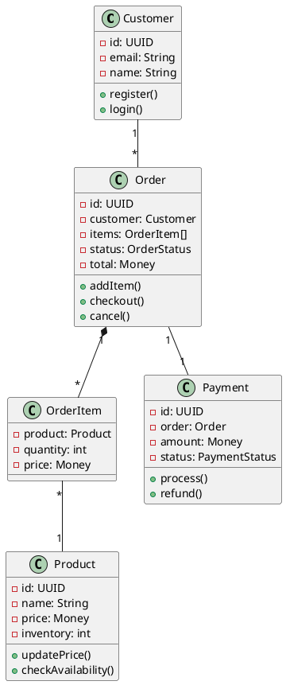
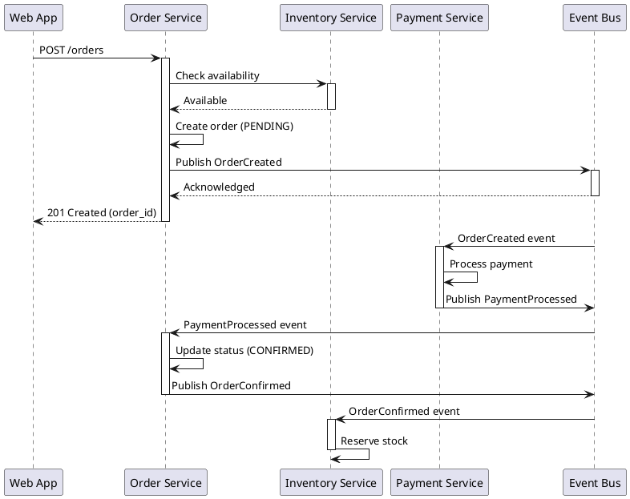
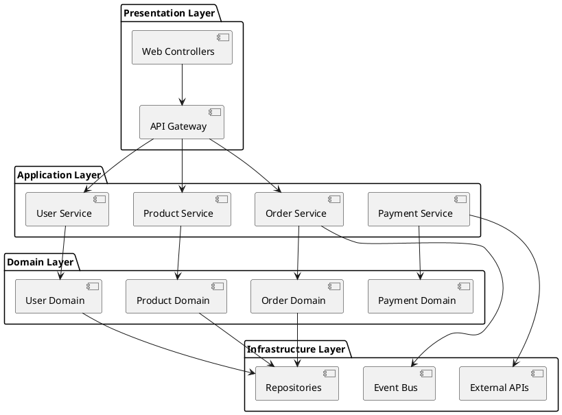
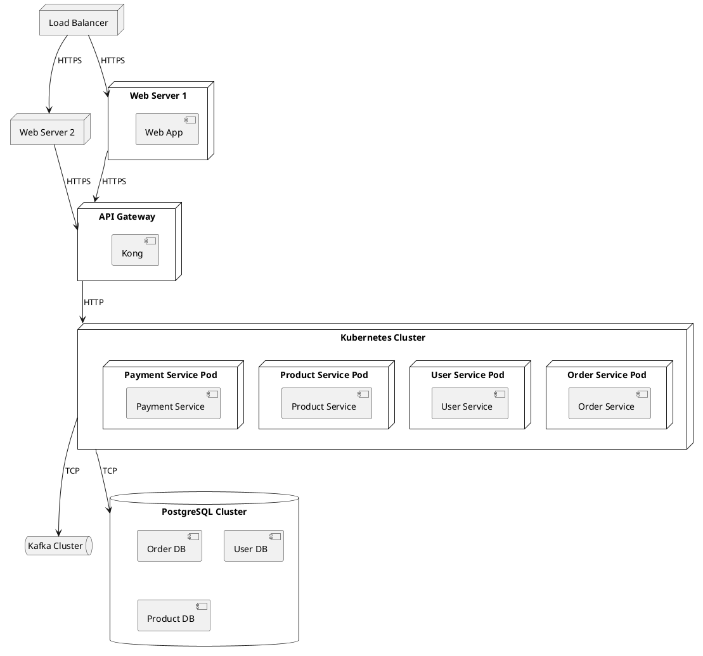
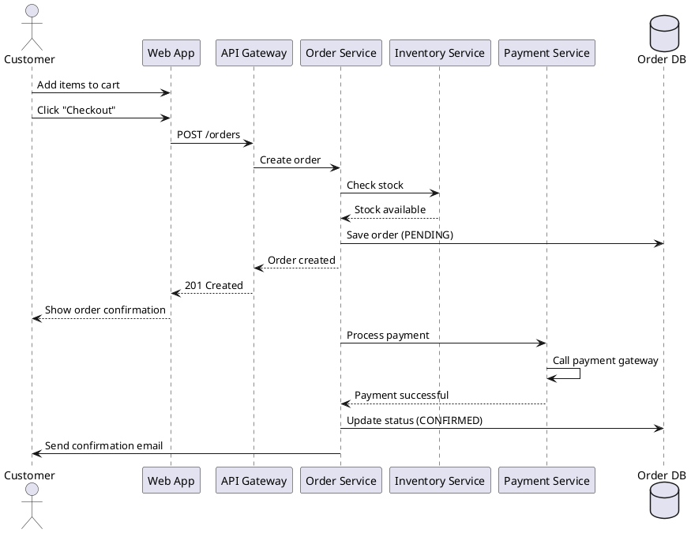
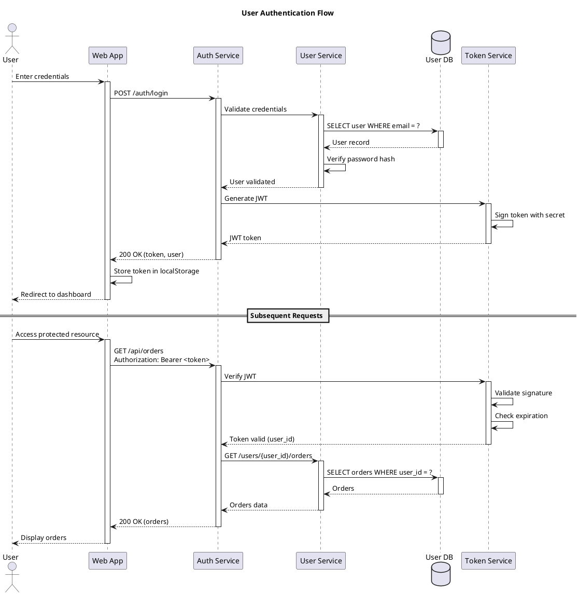
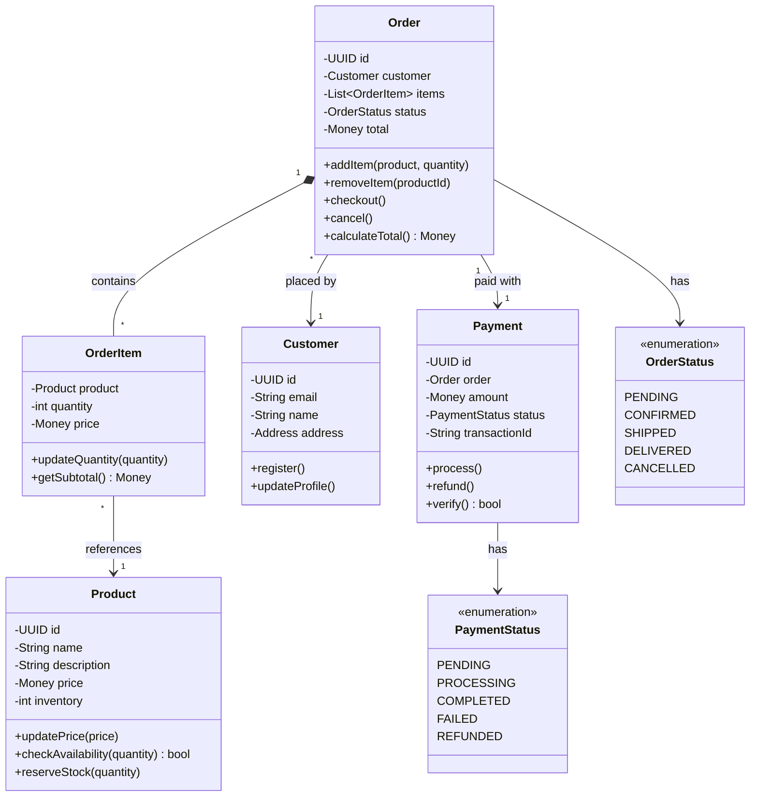
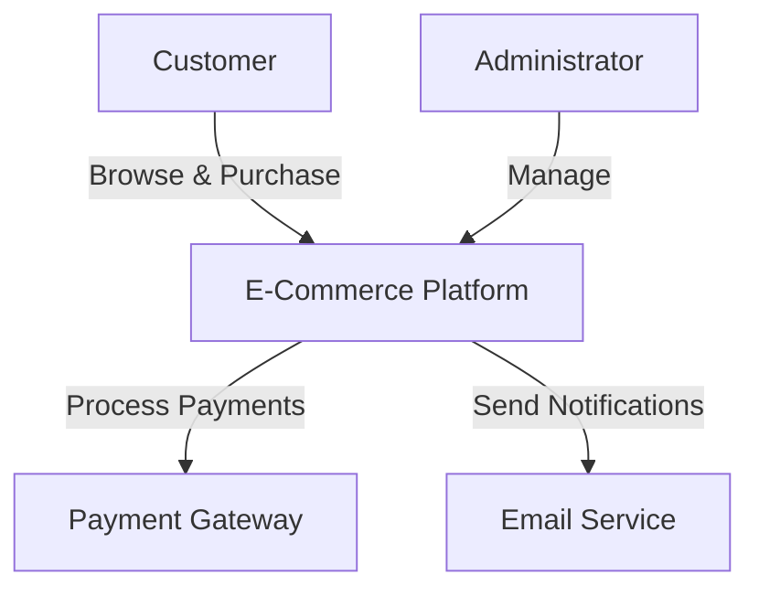

# Modeling and Documentation

## Overview

This document covers architectural modeling techniques including the 4+1 View Model, UML diagrams, C4 Model, and automated documentation generation strategies.

---

## Knowledge

### 4+1 View Model

**What is the 4+1 View Model?**
- Architectural description framework by Philippe Kruchten
- Describes software architecture from multiple perspectives
- Each view addresses specific stakeholder concerns
- "+1" represents scenarios that tie views together

**The Five Views**

**1. Logical View (Functionality)**
- **Purpose**: What the system does
- **Audience**: End users, analysts
- **Diagrams**: Class diagrams, state diagrams
- **Focus**: Functional requirements, domain model
- **Elements**: Classes, interfaces, packages, modules

**2. Process View (Concurrency)**
- **Purpose**: How the system executes
- **Audience**: System integrators, performance engineers
- **Diagrams**: Activity diagrams, sequence diagrams
- **Focus**: Concurrency, distribution, performance, scalability
- **Elements**: Processes, threads, tasks

**3. Development View (Organization)**
- **Purpose**: How the system is organized for development
- **Audience**: Developers, project managers
- **Diagrams**: Package diagrams, component diagrams
- **Focus**: Software management, reusability
- **Elements**: Modules, layers, subsystems

**4. Physical View (Deployment)**
- **Purpose**: Where the system runs
- **Audience**: System engineers, operations
- **Diagrams**: Deployment diagrams
- **Focus**: Topology, installation, communication
- **Elements**: Nodes, hardware, networks

**5. Scenarios (+1)**
- **Purpose**: Validate and illustrate architecture
- **Audience**: All stakeholders
- **Diagrams**: Use case diagrams, sequence diagrams
- **Focus**: Key use cases, quality attributes
- **Elements**: Use cases, scenarios, user stories

### UML (Unified Modeling Language)

**Structural Diagrams**

**Class Diagram**
- Shows classes, attributes, methods, relationships
- Relationships: association, aggregation, composition, inheritance
- Visibility: public (+), private (-), protected (#)
- Multiplicity: 1, 0..1, 0..*, 1..*

**Component Diagram**
- Shows components and dependencies
- Interfaces (provided/required)
- Component boundaries
- Deployment units

**Package Diagram**
- Shows package organization
- Package dependencies
- Namespace hierarchy
- Module structure

**Deployment Diagram**
- Shows physical deployment
- Nodes (hardware/execution environments)
- Artifacts (deployable units)
- Communication paths

**Behavioral Diagrams**

**Sequence Diagram**
- Shows object interactions over time
- Messages between objects
- Lifelines and activation boxes
- Return messages

**Activity Diagram**
- Shows workflow and business processes
- Actions and decisions
- Parallel flows (fork/join)
- Swim lanes for responsibilities

**State Machine Diagram**
- Shows object states and transitions
- States, events, guards, actions
- Entry/exit actions
- Nested states

**Use Case Diagram**
- Shows system functionality
- Actors and use cases
- Relationships: include, extend, generalization
- System boundary

### C4 Model

**What is the C4 Model?**
- Hierarchical set of diagrams for software architecture
- Created by Simon Brown
- Four levels of abstraction
- Simple, accessible notation

**Level 1: System Context Diagram**
- **Purpose**: Big picture view
- **Audience**: Everyone (technical and non-technical)
- **Shows**: System, users, external systems
- **Hides**: Internal details
- **Notation**: Boxes and lines

**Level 2: Container Diagram**
- **Purpose**: High-level technology choices
- **Audience**: Technical people inside and outside team
- **Shows**: Containers (applications, data stores, microservices)
- **Hides**: Implementation details
- **Notation**: Boxes for containers, lines for interactions

**Level 3: Component Diagram**
- **Purpose**: Internal structure of containers
- **Audience**: Software architects and developers
- **Shows**: Components and their interactions
- **Hides**: Code-level details
- **Notation**: Boxes for components, lines for dependencies

**Level 4: Code Diagram**
- **Purpose**: Implementation details
- **Audience**: Developers
- **Shows**: Classes, interfaces, methods
- **Hides**: Nothing (most detailed)
- **Notation**: UML class diagrams, ER diagrams

**C4 Notation**
- **Person**: User or actor (blue)
- **Software System**: Highest level of abstraction (gray)
- **Container**: Deployable/executable unit (light blue)
- **Component**: Grouping of related functionality (darker blue)
- **Relationship**: Interaction with description and technology

### Architecture Documentation

**Architecture Decision Records (ADRs)**

**ADR Structure**
```markdown
# ADR-NNN: Title

## Status
[Proposed | Accepted | Deprecated | Superseded]

## Context
What is the issue we're facing?
What factors are driving this decision?

## Decision
What are we going to do?
What is the change we're making?

## Consequences
What becomes easier or harder?
What are the trade-offs?
```

**ADR Best Practices**
- One decision per ADR
- Immutable (create new ADR to reverse)
- Version controlled with code
- Short and focused
- Include date and author

**Documentation as Code**

**Benefits**
- Version controlled
- Reviewed like code
- Automated generation
- Always up-to-date
- Searchable

**Tools**
- **Markdown**: Simple, readable, version-controllable
- **AsciiDoc**: More features than Markdown
- **MkDocs**: Static site generator for documentation
- **Docusaurus**: React-based documentation framework
- **Sphinx**: Python documentation generator

**Diagram as Code**

**PlantUML**
- Text-based UML diagrams
- Supports all UML diagram types
- Integration with IDEs and CI/CD
- Version controllable

**Mermaid**
- Markdown-embedded diagrams
- Flowcharts, sequence diagrams, class diagrams
- Rendered in GitHub, GitLab, Notion
- Simple syntax

**Structurizr DSL**
- C4 model diagrams as code
- Workspace-based approach
- Multiple output formats
- Automatic layout

---

## Skills

### Creating 4+1 Views

**Skill: Develop Logical View**
- Identify key abstractions (domain model)
- Define class structure and relationships
- Document design patterns used
- Show module organization

**Skill: Develop Process View**
- Identify concurrent processes
- Map process communication
- Document synchronization mechanisms
- Show runtime behavior

**Skill: Develop Development View**
- Organize code into layers/modules
- Define package dependencies
- Establish coding standards
- Document build structure

**Skill: Develop Physical View**
- Map software to hardware
- Define deployment topology
- Document network configuration
- Show scalability approach

**Skill: Create Scenarios**
- Identify key use cases
- Create sequence diagrams
- Validate architecture decisions
- Demonstrate quality attributes

### Creating UML Diagrams

**Skill: Create Class Diagrams**
- Identify classes and relationships
- Define attributes and methods
- Show inheritance hierarchies
- Document design patterns

**Skill: Create Sequence Diagrams**
- Identify participants (objects/actors)
- Show message flow over time
- Document interaction logic
- Highlight synchronous/asynchronous calls

**Skill: Create Component Diagrams**
- Identify major components
- Define interfaces (provided/required)
- Show dependencies
- Document component responsibilities

**Skill: Create Deployment Diagrams**
- Map components to nodes
- Show network topology
- Document protocols
- Identify deployment artifacts

### Creating C4 Diagrams

**Skill: Create System Context Diagram**
- Identify system boundary
- Show users and external systems
- Document high-level interactions
- Keep it simple (one page)

**Skill: Create Container Diagram**
- Identify containers (apps, databases, services)
- Show technology choices
- Document inter-container communication
- Highlight deployment units

**Skill: Create Component Diagram**
- Break down containers into components
- Show component responsibilities
- Document dependencies
- Identify key abstractions

**Skill: Create Code Diagrams**
- Show class structure
- Document important relationships
- Highlight design patterns
- Focus on critical areas

### Writing ADRs

**Skill: Document Architectural Decisions**
- Identify significant decisions
- Capture context and constraints
- Document alternatives considered
- List consequences and trade-offs

**Skill: Maintain ADR Log**
- Number ADRs sequentially
- Keep ADRs immutable
- Link related ADRs
- Update index/table of contents

### Generating Documentation

**Skill: Automate Diagram Generation**
- Generate diagrams from code
- Use PlantUML/Mermaid in CI/CD
- Keep diagrams in sync with code
- Version control diagram sources

**Skill: Create Living Documentation**
- Extract documentation from code
- Generate API documentation
- Automate architecture views
- Keep documentation current

---

## Examples

### Example 1: 4+1 Views for E-Commerce Platform

**Logical View: Domain Model**



**Process View: Order Processing**



**Development View: Package Structure**



**Physical View: Deployment**



**Scenario: Place Order**



### Example 2: C4 Model for Microservices Platform

**Level 1: System Context**

```
┌─────────────────────────────────────────────────────────────┐
│                                                             │
│                    E-Commerce Platform                      │
│                                                             │
│  ┌──────────┐                                 ┌──────────┐ │
│  │          │    Browse products              │          │ │
│  │ Customer │────────────────────────────────▶│   Web    │ │
│  │          │    Place orders                 │   App    │ │
│  │          │◀────────────────────────────────│          │ │
│  └──────────┘                                 └──────────┘ │
│                                                             │
│  ┌──────────┐                                 ┌──────────┐ │
│  │          │    Manage products              │  Admin   │ │
│  │  Admin   │────────────────────────────────▶│  Portal  │ │
│  │          │    View reports                 │          │ │
│  │          │◀────────────────────────────────│          │ │
│  └──────────┘                                 └──────────┘ │
│                                                             │
└─────────────────────────────────────────────────────────────┘
                          │
                          │ Process payments
                          ▼
                  ┌──────────────┐
                  │   Payment    │
                  │   Gateway    │
                  │  (External)  │
                  └──────────────┘
```

**Level 2: Container Diagram**

```
┌─────────────────────────────────────────────────────────────────┐
│                    E-Commerce Platform                          │
│                                                                 │
│  ┌──────────────┐         ┌──────────────┐                     │
│  │   Web App    │         │ API Gateway  │                     │
│  │   (React)    │────────▶│    (Kong)    │                     │
│  └──────────────┘  HTTPS  └──────────────┘                     │
│                                  │                              │
│                                  │ HTTP                         │
│                    ┌─────────────┼─────────────┐               │
│                    │             │             │               │
│                    ▼             ▼             ▼               │
│            ┌──────────┐  ┌──────────┐  ┌──────────┐           │
│            │  Order   │  │ Product  │  │   User   │           │
│            │ Service  │  │ Service  │  │ Service  │           │
│            │ (Node.js)│  │ (Node.js)│  │ (Node.js)│           │
│            └──────────┘  └──────────┘  └──────────┘           │
│                 │             │             │                  │
│                 │             │             │                  │
│                 ▼             ▼             ▼                  │
│            ┌──────────┐  ┌──────────┐  ┌──────────┐           │
│            │ Order DB │  │Product DB│  │ User DB  │           │
│            │(Postgres)│  │(Postgres)│  │(Postgres)│           │
│            └──────────┘  └──────────┘  └──────────┘           │
│                                                                 │
│            ┌────────────────────────────────────┐              │
│            │        Event Bus (Kafka)           │              │
│            └────────────────────────────────────┘              │
│                                                                 │
└─────────────────────────────────────────────────────────────────┘
```

**Level 3: Component Diagram (Order Service)**

```
┌─────────────────────────────────────────────────────────────┐
│                    Order Service                            │
│                                                             │
│  ┌──────────────────┐                                       │
│  │ Order Controller │                                       │
│  │  (REST API)      │                                       │
│  └────────┬─────────┘                                       │
│           │                                                 │
│           ▼                                                 │
│  ┌──────────────────┐         ┌──────────────────┐         │
│  │ Order Use Cases  │────────▶│  Order Domain    │         │
│  │  (Application)   │         │   (Entities)     │         │
│  └────────┬─────────┘         └──────────────────┘         │
│           │                                                 │
│           ▼                                                 │
│  ┌──────────────────┐         ┌──────────────────┐         │
│  │Order Repository  │────────▶│   Order DB       │         │
│  │  (Interface)     │         │  (PostgreSQL)    │         │
│  └──────────────────┘         └──────────────────┘         │
│                                                             │
│  ┌──────────────────┐         ┌──────────────────┐         │
│  │  Event Publisher │────────▶│   Event Bus      │         │
│  │                  │         │    (Kafka)       │         │
│  └──────────────────┘         └──────────────────┘         │
│                                                             │
└─────────────────────────────────────────────────────────────┘
```

### Example 3: PlantUML Sequence Diagram



### Example 4: Mermaid Class Diagram



### Example 5: Architecture Decision Record

```markdown
# ADR-003: Use Event-Driven Architecture for Order Processing

## Status
Accepted

## Date
2026-02-05

## Context
Our current order processing system uses synchronous REST API calls between services:
- Order Service → Inventory Service (check stock)
- Order Service → Payment Service (process payment)
- Order Service → Notification Service (send emails)

**Problems:**
1. **Tight Coupling**: Order Service depends on availability of all downstream services
2. **Cascading Failures**: If Payment Service is down, entire order flow fails
3. **Performance**: Synchronous calls increase latency (300ms+ per order)
4. **Scalability**: Difficult to scale individual services independently

**Requirements:**
- Decouple services for independent deployment
- Improve resilience (handle partial failures)
- Reduce order processing latency
- Enable asynchronous workflows

## Decision
We will implement event-driven architecture using Apache Kafka for order processing:

**Architecture:**
```
Order Service → Kafka → [Inventory, Payment, Notification] Services
```

**Event Flow:**
1. Order Service publishes `OrderCreated` event
2. Inventory Service subscribes and reserves stock
3. Payment Service subscribes and processes payment
4. Notification Service subscribes and sends confirmation

**Implementation:**
- **Event Bus**: Apache Kafka (3 brokers, replication factor 3)
- **Event Schema**: Avro with Schema Registry
- **Retry Strategy**: Exponential backoff with dead letter queue
- **Idempotency**: Event deduplication using event IDs
- **Monitoring**: Kafka lag monitoring, event tracing

**Event Schema Example:**
```json
{
  "type": "record",
  "name": "OrderCreated",
  "fields": [
    {"name": "orderId", "type": "string"},
    {"name": "customerId", "type": "string"},
    {"name": "items", "type": {"type": "array", "items": "OrderItem"}},
    {"name": "total", "type": "double"},
    {"name": "timestamp", "type": "long"}
  ]
}
```

## Consequences

### Positive
✅ **Loose Coupling**: Services don't need to know about each other
✅ **Resilience**: Services can fail independently without affecting others
✅ **Scalability**: Easy to add new consumers without changing producers
✅ **Performance**: Asynchronous processing reduces latency (100ms vs 300ms)
✅ **Audit Trail**: All events are logged in Kafka for debugging
✅ **Flexibility**: Easy to add new event consumers (analytics, reporting)

### Negative
❌ **Complexity**: More moving parts (Kafka cluster, schema registry)
❌ **Eventual Consistency**: Order status updates are not immediate
❌ **Debugging**: Harder to trace requests across services
❌ **Operational Overhead**: Need to manage Kafka infrastructure
❌ **Learning Curve**: Team needs to learn event-driven patterns

### Mitigation Strategies
- **Distributed Tracing**: Implement OpenTelemetry for request tracing
- **Event Versioning**: Use Avro schema evolution for backward compatibility
- **Monitoring**: Set up Kafka lag alerts and event processing metrics
- **Documentation**: Create event catalog documenting all events
- **Testing**: Implement contract testing for event schemas

## Alternatives Considered

### Alternative 1: Keep Synchronous REST
- **Pros**: Simpler, easier to debug, immediate consistency
- **Cons**: Tight coupling, cascading failures, poor scalability
- **Rejected**: Doesn't address core problems

### Alternative 2: Use Message Queue (RabbitMQ)
- **Pros**: Simpler than Kafka, good for task queues
- **Cons**: Not designed for event streaming, limited retention
- **Rejected**: Kafka better for event sourcing and replay

### Alternative 3: Use AWS EventBridge
- **Pros**: Managed service, no infrastructure
- **Cons**: Vendor lock-in, higher cost at scale
- **Rejected**: Want to avoid cloud vendor lock-in

## Implementation Plan

**Phase 1: Infrastructure (Week 1-2)**
- Set up Kafka cluster (3 brokers)
- Configure Schema Registry
- Set up monitoring (Prometheus + Grafana)

**Phase 2: Order Service (Week 3-4)**
- Implement event publishing
- Add event schema definitions
- Update order creation flow

**Phase 3: Consumer Services (Week 5-6)**
- Migrate Inventory Service to event consumer
- Migrate Payment Service to event consumer
- Migrate Notification Service to event consumer

**Phase 4: Testing & Rollout (Week 7-8)**
- Integration testing
- Load testing
- Gradual rollout (10% → 50% → 100%)

## References
- "Designing Event-Driven Systems" by Ben Stopford
- "Building Event-Driven Microservices" by Adam Bellemare
- Kafka Documentation: https://kafka.apache.org/documentation/
- Event-Driven Architecture Pattern: https://martinfowler.com/articles/201701-event-driven.html
```

### Example 6: Automated Documentation with MkDocs

**mkdocs.yml**
```yaml
site_name: E-Commerce Platform Architecture
site_description: Architecture documentation for e-commerce platform
site_author: Architecture Team

theme:
  name: material
  palette:
    primary: indigo
    accent: indigo
  features:
    - navigation.tabs
    - navigation.sections
    - toc.integrate
    - search.suggest

nav:
  - Home: index.md
  - Architecture:
      - Overview: architecture/overview.md
      - System Context: architecture/system-context.md
      - Containers: architecture/containers.md
      - Components: architecture/components.md
  - Design Decisions:
      - ADR Index: decisions/index.md
      - ADR-001 Microservices: decisions/adr-001-microservices.md
      - ADR-002 Database Per Service: decisions/adr-002-database-per-service.md
      - ADR-003 Event-Driven: decisions/adr-003-event-driven.md
  - API Documentation:
      - Order Service: api/order-service.md
      - Product Service: api/product-service.md
      - User Service: api/user-service.md
  - Deployment:
      - Infrastructure: deployment/infrastructure.md
      - CI/CD Pipeline: deployment/cicd.md
      - Monitoring: deployment/monitoring.md

plugins:
  - search
  - mermaid2
  - plantuml

markdown_extensions:
  - admonition
  - codehilite
  - toc:
      permalink: true
  - pymdownx.superfences:
      custom_fences:
        - name: mermaid
          class: mermaid
          format: !!python/name:pymdownx.superfences.fence_code_format
```

**docs/architecture/overview.md**
```markdown
# Architecture Overview

## System Context



## Container Diagram

See [Containers](containers.md) for detailed container architecture.

## Key Architectural Decisions

- [ADR-001: Microservices Architecture](../decisions/adr-001-microservices.md)
- [ADR-002: Database Per Service](../decisions/adr-002-database-per-service.md)
- [ADR-003: Event-Driven Architecture](../decisions/adr-003-event-driven.md)

## Quality Attributes

| Attribute | Target | Measurement |
|-----------|--------|-------------|
| Availability | 99.9% | Uptime monitoring |
| Latency | < 200ms | P95 response time |
| Throughput | 1000 req/s | Load testing |
| Scalability | 10x traffic | Horizontal scaling |
```

---

## Understanding

### When to Use 4+1 Views

**Use 4+1 Views When:**
- Complex system with multiple stakeholders
- Need to address different concerns (functionality, deployment, development)
- Large team with specialized roles
- Regulatory documentation requirements

**Don't Use 4+1 Views When:**
- Simple system with few components
- Small team (everyone understands everything)
- Rapid prototyping phase
- Overkill for the project size

### When to Use UML vs C4

**Use UML When:**
- Detailed design documentation needed
- Team familiar with UML
- Tool support available
- Formal modeling required

**Use C4 When:**
- Need simple, accessible diagrams
- Communicating with non-technical stakeholders
- Want to avoid UML complexity
- Focus on architecture over design

**Use Both:**
- C4 for high-level architecture
- UML for detailed design

### ADR Best Practices

**Do:**
- Write ADRs for significant decisions
- Keep ADRs short and focused
- Version control with code
- Link related ADRs
- Include consequences (positive and negative)

**Don't:**
- Document trivial decisions
- Modify existing ADRs (create new one)
- Write ADRs after implementation
- Skip alternatives considered
- Forget to update ADR index

### Documentation Automation

**Automate:**
- Diagram generation from code
- API documentation from OpenAPI specs
- Architecture views from models
- Dependency graphs
- Metrics and dashboards

**Don't Automate:**
- Architectural decisions (ADRs)
- Design rationale
- Trade-off analysis
- Stakeholder concerns

### Common Pitfalls

**4+1 Views Pitfalls:**
- Creating all views when not needed
- Views not aligned with each other
- Too much detail in early stages
- Forgetting scenarios (+1)

**UML Pitfalls:**
- Over-complicating diagrams
- Using wrong diagram type
- Too much detail
- Not keeping diagrams updated

**C4 Pitfalls:**
- Skipping levels (going straight to code)
- Inconsistent notation
- Too many elements per diagram
- Not defining boundaries clearly

**ADR Pitfalls:**
- Writing ADRs after the fact
- Not documenting alternatives
- Modifying existing ADRs
- Missing consequences

---

## References

### 4+1 View Model
- **Paper**: "Architectural Blueprints—The '4+1' View Model of Software Architecture" by Philippe Kruchten
- **Book**: "Software Architecture in Practice" by Bass, Clements, Kazman

### UML
- **Official**: OMG UML Specification: https://www.omg.org/spec/UML/
- **Books**:
  - "UML Distilled" by Martin Fowler
  - "Applying UML and Patterns" by Craig Larman
- **Tools**: PlantUML, StarUML, Visual Paradigm

### C4 Model
- **Official**: https://c4model.com/
- **Tools**:
  - Structurizr: https://structurizr.com/
  - PlantUML C4: https://github.com/plantuml-stdlib/C4-PlantUML
  - Mermaid: https://mermaid-js.github.io/

### ADRs
- **GitHub**: https://adr.github.io/
- **Tools**:
  - adr-tools: https://github.com/npryce/adr-tools
  - log4brains: https://github.com/thomvaill/log4brains
- **Templates**: https://github.com/joelparkerhenderson/architecture-decision-record

### Documentation Tools
- **MkDocs**: https://www.mkdocs.org/
- **Docusaurus**: https://docusaurus.io/
- **Sphinx**: https://www.sphinx-doc.org/
- **AsciiDoc**: https://asciidoc.org/

### Related Architecture Documents
- [Fundamentals](./fundamentals.md) - Core architectural elements
- [Tools and Methodologies](./tools-methodologies.md) - TOGAF, DDD, CI/CD
- [Quality Attributes](./quality-attributes.md) - Non-functional requirements
- [Microservices Architecture](./microservices-architecture.md) - Microservices patterns


